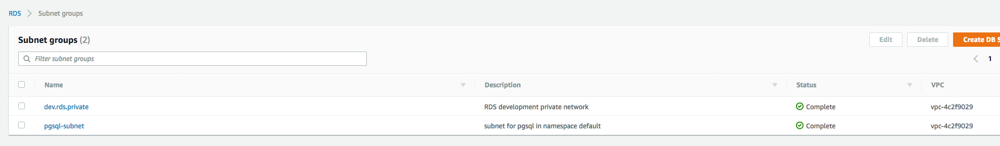
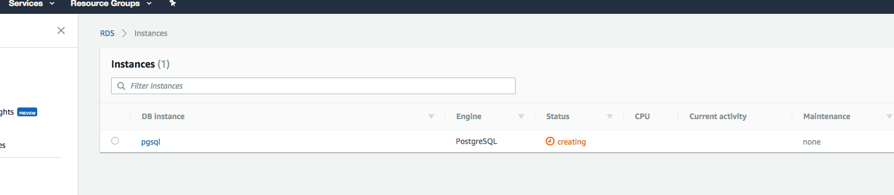

# k8s-rds

[](https://travis-ci.org/sorenmat/k8s-rds)
[](https://goreportcard.com/report/github.com/sorenmat/k8s-rds)

A Custom Resource Definition for provisioning AWS RDS databases.

State: BETA - use with caution

## Assumptions

The node running the pod should have an instance profile that allows creation and deletion of RDS databases and Subnets.

The codes will search for the first node, and take the subnets from that node. And depending on wether or not your DB should be public, then filter them on that. If any subnets left it will attach the DB to that.

## Building

`go build`

## Installing

You can start the the controller by applying `kubectl apply -f deploy/deployment.yaml`

### RBAC deployment

To create ClusterRole and bindings, apply the following instead:

```shell
kubectl apply -f deploy/operator-cluster-role.yaml
kubectl apply -f deploy/operator-service-account.yaml
kubectl apply -f deploy/operator-cluster-role-binding.yaml
kubectl apply -f deploy/deployment-rbac.yaml
```

## Deploying

When the controller is running in the cluster you can deploy/create a new database by running `kubectl apply` on the following
file.

```yaml
apiVersion: v1
kind: Secret
metadata:
  name: mysecret
type: Opaque
data:
  mykey: cGFzc3dvcmRvcnNvbWV0aGluZw==
---
apiVersion: k8s.io/v1
kind: Database
metadata:
  name: pgsql
  namespace: default
spec:
  class: db.t2.medium # type of the db instance
  engine: postgres # what engine to use postgres, mysql, aurora-postgresql etc.
  dbname: pgsql # name of the initial created database
  name: pgsql # name of the database at the provider
  password: # link to database secret
    key: mykey # the key in the secret
    name: mysecret # the name of the secret
  username: postgres # Database username
  size: 10 # size in BG
  backupretentionperiod: 10 # days to keep backup, 0 means diable
  parametergroup: default.postgres10
  encrypted: true # should the database be encrypted
  iops: 1000 # number of iops
  multiaz: true # multi AZ support
  storagetype: gp2 # type of the underlying storage
```

Note that `backupretentionperiod` may be:
- 0: backup are disabled
- unspecified: default value (1) is used

See AWS reference documentation for details.


After the deploy is done you should be able to see your database via `kubectl get databases`

```shell
NAME         AGE
test-pgsql   11h
```

### Restore from Snapshot

If you use the `dbsnapshotidentifier` spec, it will create the database instance from the specified snapshot.

In this case, note that:
- `username` cannot be changed from snapshot original username and is not taken in account
- `encrypted` cannot be changed from snapshot orignial encryption and is not taken in account
- `password` may be empty (or unspecified): it will keep the password from snapshot
- `size` may be 0 (or unspecified): it will keep the original size from snapshot
- `backupretentionperiod` may be unspecified: it will keep the original retention period from snapshot

Any of following options need to be applied once database instance has been restored if specified:
- `password`
- `size`
- `backupretentionperiod`

### Subnets and Security Group Ids

By default, subnets are detected automatically from cluster and a dedicated Database Subnet group is created and deleted by the operator.

You can override this by:
* specifying a list of VPC subnets (at least 2)
```yaml
spec:
  subnets:
  - subnet-0a378a72330fea864
  - subnet-0c4fb739e201fc2a3
  - subnet-0739bd9fa24055c4b
```
A dedicated Database Subnet group is still created / deleted by the operator.

* specifying directly a Database Subnet group that you manage (the operator will not try to create or delete it):
```yaml
spec:
  subnetgroup: rds-subnet-group
```

Security group ids are also detected automatically and you can override with the following spec:
```yaml
spec:
  securitygroups:
  - sg-13cbg6c2
```

And on the AWS RDS page





# TODO

- [X] Basic RDS support

- [X] Basic RDS support (Restore from snapshot)

- [ ] Cluster support

- [ ] Google Cloud SQL for PostgreSQL support

- [ ] Local PostgreSQL support

